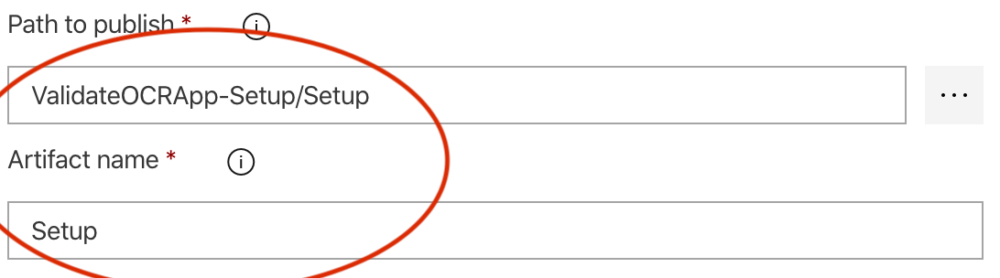
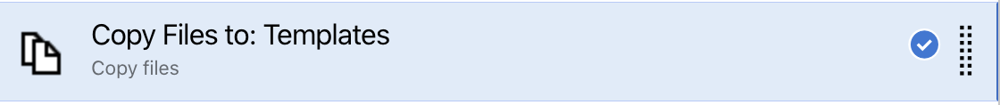

# ValidateOCRApp


The purpose of this document is to provide an idea on how to implement an automated Approval process workflow using Azure Durable Function and then how to finally automate the setup and deployment of the entire application and its ancilliary services.

The project folder structure is divided into 2 sections -

- Application Code - Containing the source code of the entire flow
- Deployment or Setup - This is IaaC or Infrastructure as Code to setup the entire process - end to end

Let us delve into each one of these one by one

## ValidateOCRApp

### Blob Trigger

Blob trigger function with an initialised Orchestrator client argument. This client will be responsible for initiation 			of an Orchestrator function which subsequently would flow through.

```c#
[FunctionName("ValidateOCRAppStart")]
public static async Task ValidateOCRAppStart([BlobTrigger("ocrinfoblob/{name}")]
                                             CloudBlockBlob cloudBlockBlob,
                                             [Blob("ocrinfoblob/{name}",
                                             FileAccess.ReadWrite)]
                                             byte[] blobContents,                                              																							[OrchestrationClient]
                                             DurableOrchestrationClient
                                             starter, ILogger logger)
{

  var blobInfoModel = new BlobInfoModel()
  {

    ImageName = cloudBlockBlob.Name,
    BlobContents = blobContents

  };

  string instanceId = await  starter.StartNewAsync("ProcessBlobContents", blobInfoModel);
  logger.LogInformation($"Started orchestration with ID = '{instanceId}'.");

}
```

### Orchestrator Function

Receives Blob images through *OrchestrationTrigger* from *OrchestrationClient*. This function would then pass on the Blob image to a Cognitive API call on Azure - OCR; to retrieve the Text content within the image. 

```c#
[FunctionName("ProcessBlobContents")]
public static async Task ProcessBlobContents([OrchestrationTrigger]
																						DurableOrchestrationContext context)
{

  var blobInfoModel = context.GetInput<BlobInfoModel>();
  var blobContents = blobInfoModel.BlobContents;

  var parsedOCRString = await context.CallActivityAsync<string>("ParseOCR", blobContents);

  var ocrInfoModel = JsonConvert.DeserializeObject<OCRInfoModel>(parsedOCRString);
  var approvalModel = new ApprovalModel()
  {
    InstanceId = context.InstanceId,
    Language = ocrInfoModel.Language

  };

  await context.CallActivityAsync("SendForApproval", approvalModel);

  using (var cts = new CancellationTokenSource())
  {

    var dueTime = context.CurrentUtcDateTime.AddMinutes(3);
    var timerTask = context.CreateTimer(dueTime, cts.Token);
    var approvalTask = context.WaitForExternalEvent<bool>("Approval");
    var completedTask = await Task.WhenAny(approvalTask, timerTask);

    var isApproved = approvalTask.Result;
    var uploadImageModel = new UploadImageModel()
    {

      IsApproved = isApproved,
      BlobContents = blobContents,
      ImageName = blobInfoModel.ImageName

    };

    await context.CallActivityAsync("PostApproval", uploadImageModel);                

    }
}
```

Response comes back as a JSON content -

```c#
var parsedOCRString = await context.CallActivityAsync<string>("ParseOCR", blobContents);
```

The function then Places this API response  into an Azure Queue and starts waiting for an External event - which is nothing but Approval process -

```C#
var approvalTask = context.WaitForExternalEvent<bool>("Approval");
```

Important thing to note here is that the wait is not only for Approval but alos for timeout period -

```C#
var dueTime = context.CurrentUtcDateTime.AddMinutes(3);
...

var completedTask = await Task.WhenAny(approvalTask, timerTask);
...
  
```

When Any one of these happens - either a timeout or the approval event is fired, the wait here is over. Rest of the function app is nothing but sending this to an Azure Queue for further processing -

### PostApproval

```C#
[FunctionName("PostApproval")]
public static async Task PostApprovalAsync([ActivityTrigger] UploadImageModel uploadImageModel,
																					ILogger logger)
{

  var isApproved = uploadImageModel.IsApproved;
  logger.LogInformation($"Approved:{isApproved}");
  if (isApproved == true)            
  await UploadImageToBlobAsync(uploadImageModel.BlobContents,
  uploadImageModel.ImageName);           

}
```


### ProcessQueueAsync - Queue processing Function

```c#
[FunctionName("ProcessQueue")]
public static async Task ProcessQueueAsync([QueueTrigger("ocrinfoqueue")]
                                           CloudQueueMessage cloudQueueMessage, 
                                           [OrchestrationClient] DurableOrchestrationClient
																					client, ILogger log)
{

    var queueMessageString = cloudQueueMessage.AsString;
    log.LogDebug(queueMessageString);

    var approvalModel = JsonConvert.DeserializeObject<ApprovalModel>(queueMessageString);
    var languageString = approvalModel.Language;
    //shouldApprove
    bool shouldApprove = (string.Compare(languageString, "unk",
    StringComparison.CurrentCultureIgnoreCase) != 0);

    await client.RaiseEventAsync(approvalModel.InstanceId, "Approval", shouldApprove);

}
       
```


### tmp.local.settings.json

```JSON
{
    "IsEncrypted": false,
    "Values": {
        "AzureWebJobsStorage": "<>",
        "FUNCTIONS_WORKER_RUNTIME": "dotnet",
        "OCR_API_KEY": "<>",
        "OCR_URL": "<>",
        "APPINSIGHTS_INSTRUMENTATIONKEY": "<>",
        "APPROVED_BLOB_NAME": "<>"
    }
}
```

This is to ensure that whoever checks out this code should know what value they need to add in Application settings in the portal. The original file *local.settings.json* **<u>should NOT be checked-in</u>** and kept in the local folder

Shortly we would see how some of these values which are secured e.g. *OCR_API_KEY* will kept in KeyVault and referred by Azure DevOps during *Deployment* process - that way ADO becomes single source-of-truth for KeyVault taking away all complexities of KeyVault APIs and management

## ValidateOCRApp-Setup

This folder contains files for setting up the entire infrastructure for this use case using *PowerShell* and *ARM templates*. Later on we would connect this with Azure DevOps (ADO) and bring in maximum automation.

As before lst us see the folder structure and then subsequent details:

### Templates		

#### keyvault-deploy.json

ARM template for creating/updating KeyVault which would be used for storing Secured Keys used by the 				Function app as explained above - primarily the keys which are mentioned in the *local.settings.json* file

#### keyvault-deploy.ps1

PowerShell script to execute the above ARM template

#### validateocrapp-deploy.json

ARM template for creating/updating Function App and related resources

#### validateocrapp-deploy.ps1

PowerShell script to execute the above ARM template

*Note: Script code for all the above are self-explanatory and hence not included here*

### Setup

#### validateocrapp-setup.ps1

PowerShell script for managing the entire setup process:

```powershell
param([Parameter(Mandatory=$false)] [string] $resourceGroup = "<resource_group>",
      [Parameter(Mandatory=$false)] [string] $subscriptionId = "<subscription_id>",
      [Parameter(Mandatory=$false)] [string] $baseFolderPath = "<folder_path>",
      [Parameter(Mandatory=$false)] [string] $keyVaultName = "<keyvault_name>",
      [Parameter(Mandatory=$false)] [string] $objectId = "<object_Id>",
      [Parameter(Mandatory=$false)] [string] $appName = "<app_name>",
      [Parameter(Mandatory=$false)] [string] $storageAccountName = "<storageAccount_Name>")

$templatesFolderPath = $baseFolderPath + "/Templates"
$keyvaultDeployCommand = "/keyvault-deploy.ps1 -rg $resourceGroup -fpath $templatesFolderPath -keyVaultName $keyVaultName -objectId $objectId"
$functionDeployCommand = "/validateocrapp-deploy.ps1 -rg $resourceGroup -fpath $templatesFolderPath -appName $appName -storageAccountName $storageAccountName"

# # PS Logout
# Disconnect-AzAccount

# # PS Login
# Connect-AzAccount

# PS Select Subscription 
Select-AzSubscription -SubscriptionId $subscriptionId

#  KeyVault deploy
$keyvaultDeployPath = $templatesFolderPath + $keyvaultDeployCommand
Invoke-Expression -Command $keyvaultDeployPath

#  Function deploy
$functionDeployPath = $templatesFolderPath + $functionDeployCommand
Invoke-Expression -Command $functionDeployPath
```

## Integration with DevOps

### Users

Primariy two sets of users - 

* **DevOps Admin** - Can access only the ***ValidateOCRApp-Setup*** folder; so can setup the environment
* **Developer** - Can access only the ***ValidateOCRApp*** folder i.e. Application folder; can only deploy application code. ***No access to or knowledge of*** the setup process of entire infrastructure

### CI Pipelines

#### ValidateOCRApp-Setup

##### Copy Files: Setup

​	

	 


##### Publish Artifact: Setup

##### 

	

As you can see, the Publish location of the Build artifact is **Setup** folder in this case...so all PowerShell script and JSON templates will be copied and published in the said folder. *CD* pipeline would pickup the artifact from the **Setup** folder and act accordingly

##### Copy Files: Templates

​			


##### Publish Artifact: Templates

​		

As you can see, the Publish location of the Build artifact is **Templates** folder in this case...so all PowerShell script and JSON templates will be copied and published in the said folder. *CD* pipeline would pickup the artifact from the **Templates** folder and act accordingly

##### Trigger


Please look at the *Path filters* section - *ValidateOCRApp-Setup* is the folder name; any changes in this folder only will trigger this *Setup* pipeline. So, both application developers and DevOps admin can peacefully work on their respective flows with minimal impact on each other!


#### ValidateOCRApp

#### 		

​	As mentioned earlier, only Developers should have access to it which would build the Application code (*i.e. Durable function etc., in this case*)

##### Trigger

​				

Please look at the *Path filters* section - *ValidateOCRApp* is the folder name; any changes in this folder only will trigger this *Application Deployment* pipeline. So, both application developers and DevOps admin can peacefully work on their respective flows with minimal impact on each other!

​		

### CD Pipelines

#### ValidateOCRApp-Setup

​						

​			

### Manual Intervention

​																	

This is an important task...as I always mention that 100% automation is NOT always possible.

There are and there will be scenarios which need some Manual intervention or other for meeting some lager goal; e.g. like in this case, the job of the DevOps admin who is running this Setup CD pipeline, is to check and add the OCR API key into the KeyVault - so he has to go the portal and get the API ket from respective resource(s) and then add into the KeyVault.

Application deployment steps in ADO can actually read from KeyVault and proceed seamlessly.

As you can see, *Notify users* section actually can notify multiple folks to perform this Manual Intervention task. ADO will Pause execution of the pipeline at this stage and will wait for a Manual Resume/Reject decision by the designated person (*one of DevOps Admin group or can be someone else from the Team as decided by DevOps admin*)

​		

#### ValidateOCRApp

​			

This is the Application Deployment step and only one task - *Deploy Azure Function App*

=================================X======================================